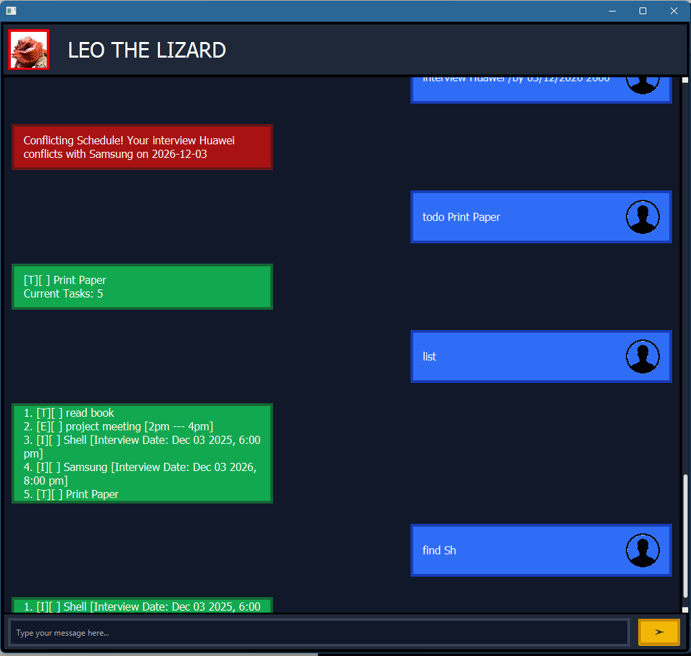

# Leo The Lizard User Guide





Leo The Lizard is a chatbot that tracks your daily tasks. Simply add your tasks into the chat and Leo would organise them for you!


# Features

---
## Adding a Task

Adds a task without any date or time.

### Format
`todo DESCRIPTION`

### Example
`todo read book`

### Expected Output
```
[T][ ] read book
Current Tasks: 1
```
---
## Adding a Deadline
Adds a task with a specific deadline.

### Format
`deadline DESCRIPTION /by DD/MM/YYYY HHMM`

### Example
`deadline submit assignment /by 20/6/2026 1800`

### Expected Output
```
[D][ ] submit assignment [Due: Jun 20 2026, 6:00 pm]
Current Tasks: 2
```
---
## Adding an Event

Adds a task that has a start and end time.

### Format
`event DESCRIPTION /from START /to END`

### Example
`event project meeting /from 2pm /to 4pm`

### Expected Output
```
[E][ ] project meeting [ 2pm --- 4pm]
Current Tasks: 3
```
---

## Listing Tasks

Displays all tasks currently stored.

### Format
`list`

### Example Output
```
1. [T][ ] read book
2. [D][ ] submit assignment [Due: Jun 20 2026, 6:00 pm]
3. [E][ ] project meeting [2pm --- 4pm]
```
---

## Marking a Task as Done

Marks a specified task as completed.

### Format
`mark TASK_NUMBER`

### Example
`mark 1`

### Expected Output
```Marked: [T][X] read book```

---

## Unmarking a Task

Marks a completed task as not done.

### Format
`unmark TASK_NUMBER`

### Example
`unmark 1`

### Expected Output
```Unmarked: [T][X] read book```

---

## Deleting a Task

Removes a task from the list.

### Format
`delete TASK_NUMBER`

### Example
`delete 2`

### Expected Output
```
Deleted: [D][ ] submit assignment [Due: Jun 20 2026, 6:00 pm]
Tasks Left: 2
```

---

## Finding Tasks

Finds tasks that contain a specific keyword.

### Format
`find KEYWORD`

### Example
`find book`

### Expected Output
```1. [T][ ] read book```

---

## Adding an Interview

This task functions similarly to a Deadline Task, but adding tasks with the same date is not allowed, since interviews
within the same date may conflict.


### Example
`interview Samsung /by 12/03/2025 1800`

`interview Huawel /by 12/03/2025 2000`

### Expected Output
```Conflicting Schedule! Your interview Huawei conflicts with Samsung on 2026-12-03```

